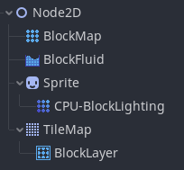
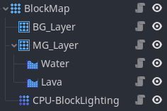
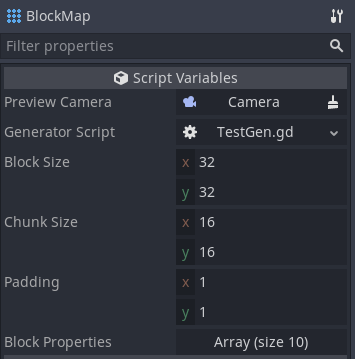
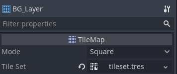
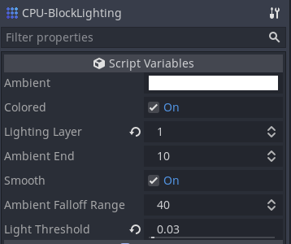

# PixelDot

Godot plugin for making 2D sandbox games like [Terraria](https://en.wikipedia.org/wiki/Terraria) and [Starbound](https://en.wikipedia.org/wiki/Starbound). This is in early development and should not be used for production projects.

[Demo](https://github.com/technistguru/PixelDot_Demo)

## Installation

Requires Godot Mono. [Documentation](https://docs.godotengine.org/en/stable/getting_started/scripting/c_sharp/c_sharp_basics.html) for using c# in Godot.

1. Create `addons/` folder in your project directory.
2. Clone this repository into the `addons/` folder.
3. Open your project in Godot and click on `Build`. You may need to create a new c# script to have this option.
4. Enable this plugin from `Project Settings -> Plugins` menu.

You should now see the custom types `BlockMap`, `BlockLayer`, and `CPU-BlockLighting` in the Create New Node menu.

## Usage

- Add `BlockMap` to your scene.
    - Create a `Camera 2D` and set `Preview Cam` of `BlockMap` to that camera.
    - Set `Block Size` to the size of your tiles in pixels.
    - Create a generator script and put it in `Generator Script`. See [GeneratorTemplate.gd](templates/GeneratorTemplate.gd) for formatting.
    - Define the properties of all your blocks in `Block Properties`.
- Add a `BlockLayer` node as a child of `BlockMap` for every layer that you want.
    - Update `Tile Set`
- Add `CPU-BlockLighting` as a child of `BlockMap`.
    - Set `Lighting Layer` to the index of the `BlockLayer` that you want to interact with the lighting.

### Example

