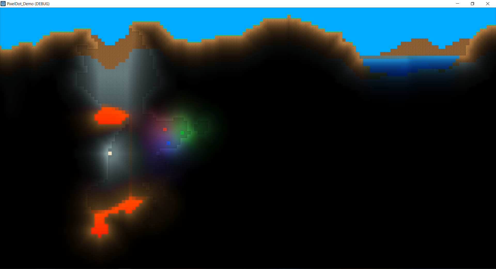

# PixelDot

Godot plugin for making 2D sandbox games like [Terraria](https://en.wikipedia.org/wiki/Terraria) and [Starbound](https://en.wikipedia.org/wiki/Starbound). This is in early development and should not be used for production projects.

[Demo](https://github.com/technistguru/PixelDot_Demo)

## Installation

Requires Godot Mono. [Documentation](https://docs.godotengine.org/en/stable/getting_started/scripting/c_sharp/c_sharp_basics.html) for using c# in Godot.

1. Create `addons/` folder in your project directory.
2. Clone this repository into the `addons/` folder.
3. Open your project in Godot and click on `Build`. You may need to create a new c# script to have this option.
4. Enable this plugin from `Project Settings -> Plugins` menu.

You should now see the custom types `BlockMap`, `BlockFluid`, `BlockLayer`, and `CPU-BlockLighting` in the Create New Node menu.

## Usage

- Add `BlockMap` to your scene.
    - Create a `Camera 2D` and set `Preview Cam` of `BlockMap` to that camera.
    - Set `Block Size` to the size of your tiles in pixels.
    - Create a generator script and put it in `Generator Script`. See [GeneratorTemplate.gd](templates/GeneratorTemplate.gd) for formatting.
    - Define the properties of all your blocks in `Block Properties`.
- Add a `BlockLayer` node as a child of `BlockMap` for every layer that you want.
    - Update `Tile Set`
- Add `BlockFluid` as a child of one of the `BlockLayer` nodes.
- Add `CPU-BlockLighting` as a child of `BlockMap`.
    - Set `Lighting Layer` to the index of the `BlockLayer` that you want to interact with the lighting.

### Example

## Parameters

### BlockMap

- `Preview Camera`: Camera used for previewing terrain.
- `Generator Script`: Script used for world generation. See [GeneratorTemplate.gd](templates/GeneratorTemplate.gd) for formatting.
- `Block Size`: Size of each block in pixels.
- `Chunk Size`: Size of each chunk in blocks.
- `Padding`: Additional chunks outside of camera.
- `Block Propetries`: Array of dictionaries containing properties of each block. Index 0 is reserved for air.
    - `Solid`: Whether the block will occlude ambient light.
    - `Light Absorb`: How much the block will absorb light for each color channel.
    - `Emit`: The light emission color of this block.
    - `Emit Strength`: The light emission strength of this block.

### Block Fluid

- `Update Fps`: The number of simulation steps that are computed every second.
- `Block Id`: The block that the simulation is run for.
- `Color`: The primary color of the fluid.
- `Color2`: The color of the fluid when it has Max Flow amount of fluid.
- `Vertical Only`: Enable if you want sand physics like in Minecraft.
- `Min Value`: The minimum amount of fluid a block can have.
- `Max Value`: The maximum amount of fluid a block can have before compression.
- `Max Compression`: The greatest difference in fluid amount two vertically adjacent blocks can have.
- `Min Flow`: The minimum amount of fluid that can flow from one block to the next.
- `Max Flow`: The maximum amount of fluid that can flow from one block to the next.
- `Flow Speed`: The speed at which fluid flows from one block to the next.

### CPU-BlockLighting

- `Ambient`: The color of ambient lighting.
- `Ambient Strength`: The strength of ambient lighting.
- `Ambient End`: The lowest elevation where ambient lighting can be at full strength.
- `Ambient Falloff Range`: The range after Ambient End where ambient lighting strength transitions to 0.
- `Light Threshold`: The minimum light value that the light is propagated for. Lower values produce higher quality lighting at the cost of performance.
- `Smooth`: Whether filter is enabled for the lighting texture that is generated.
- `Colored`: Whether colored lighting is computed. Disable for better performance.
- `Lighting Layers`: Array of integers representing the Ids of layers that will interact with lighting.